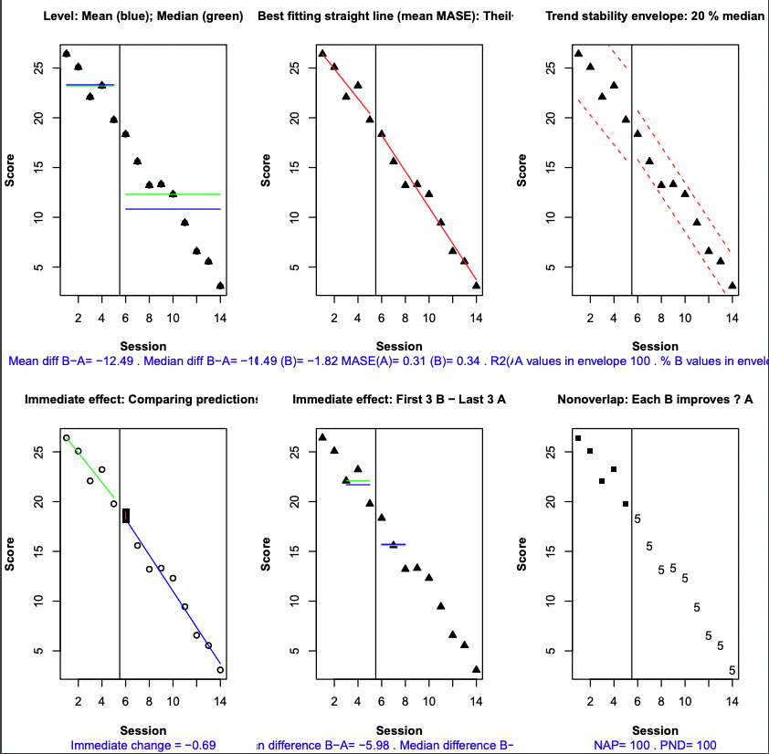
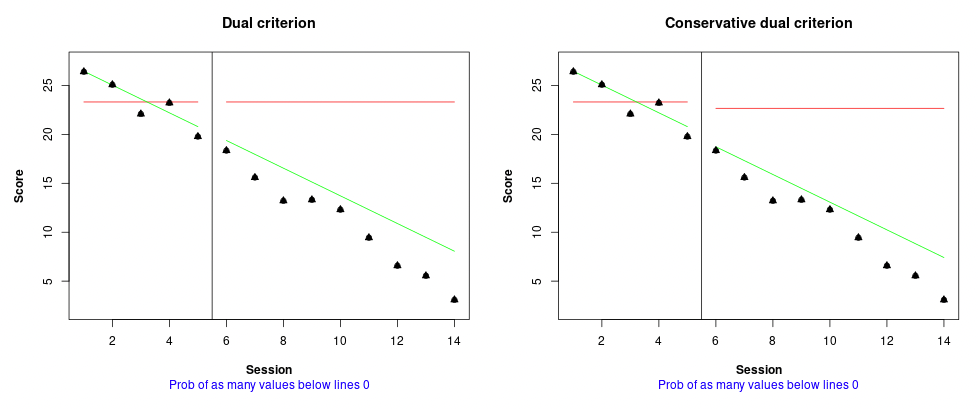
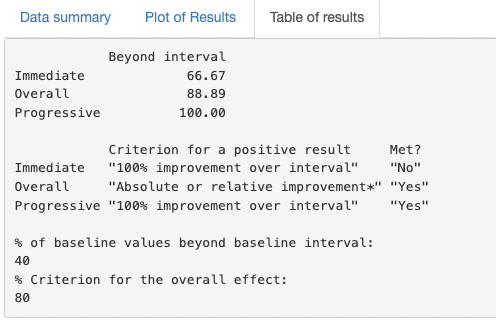
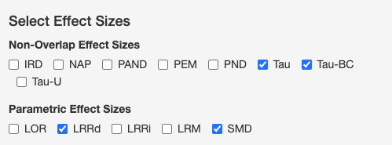
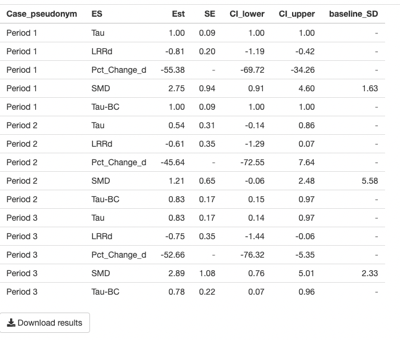
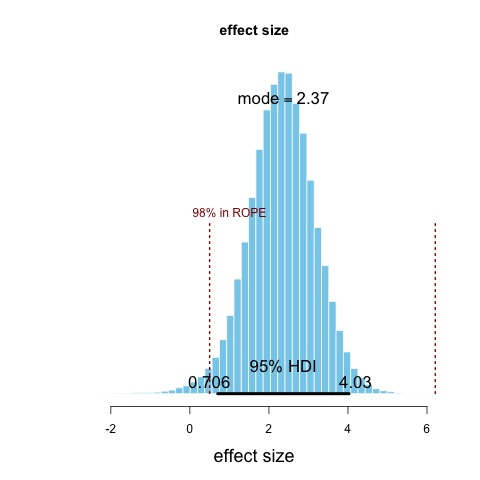
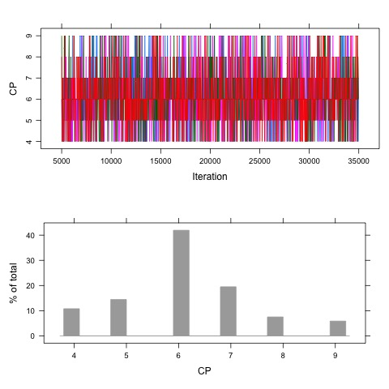

```{r setup, include=FALSE}
knitr::opts_chunk$set(echo = TRUE,warning=F,message=F,error=F)
```

# 必要なパッケージの読みこみ

```{r}
library(tidyverse)
library(knitr)
library(kableExtra)
```


## データの生成

```{r}

# ABデザインの乱数データを生成する関数を読み込む
source("docs/function/makeABdata.R")

#create data
n_data<-14 #セッション数
beta_0<-20 #　ベースラインの最終時点の値
beta_1<--1 # ベースラインの傾き
beta_2<--5 # ベースラインの最終時点と介入フェーズの開始時点の差
beta_3<--0.5 # ベースラインとの傾きの差
rho<-0.10 # 自己相関
#start_trtは介入セッションの開始時点


#Aさんのデータ
set.seed(1212)
A<-ABdata(n_data,start_trt=6,beta_0,beta_1,beta_2,beta_3,rho)

#Bさんのデータ
set.seed(1212)
B<-ABdata(n_data,8,beta_0,beta_1,beta_2,beta_3,rho)

#Cさんのデータ
set.seed(1212)
C<-ABdata(n_data,10,beta_0,beta_1,beta_2,beta_3,rho)


#write.csv(A,"data.csv")
#write.table(A, file = "data2.txt")

# 3名のデータそれぞれにラベルをつけて、データを統合
A$Subject<-"A"
B$Subject<-"B"
C$Subject<-"C"

data_all<-bind_rows(A,B,C)

#変数名を統一
names(A)<-c("y","time","treatment","Subject")
names(data_all)<-c("y","time","treatment","Subject")

#小数点をまるめる
A$y<-ceiling(A$y)
data_all$y<-ceiling(data_all$y)

#Aさんのデータ
kbl(A)%>%kable_styling()

```

```{r}
#Aさんのデータ
kbl(A)%>%kable_styling()

```


```{r}
#3名分のデータ
kbl(data_all)%>%kable_styling()
```


##  反転デザインのプロット

- `geom_line()` : データを線で繋いでプロット
- `geom_point()` : データを点でプロット
- `geom_vline()` : x軸の任意の値に垂直線を引く
  - `xintercept=which.max()` で、ベースラインの最終時点に0.5を加えて、介入期とベースライン期の間に垂直線がひかれるように指定
- `scale_x_continuous` : x軸の時点数が1~14まで全て表示されるように指定
- `annotate()`；任意の位置(xとyで指定)にテキストを追加
- ` ylim()`；y軸の表示範囲を指定、max(A$y)*1.3として上限をデータの最大値に1.3かけた値になるように指定
- ` ylab()`, ` xlab()`；x軸、y軸のラベル
- ` ylab()`, ` xlab()`；x軸、y軸のラベル
- `theme_classic()`: 最小限の白黒のシンプルなプロットにする


### Aさんデータをプロット

- 反転デザイン

```{r}


  g1<-ggplot(A)+ 
    geom_line(aes(x=time,y= y,group=treatment),size=0.7)+
    geom_point(aes(x=time,y= y,group=treatment),size=3,shape=17)+
    geom_vline(
      xintercept=which.max(
        A$time[A$treatment==0])+0.5,
      linetype=2,col="gray50")+
    scale_x_continuous(breaks=1:nrow(A))+
    ylim(0,max(A$y)*1.3)+
    ylab("OCD symptom severity (YBOCS)")+xlab("Sessions")+theme_classic()
  
  g1+annotate(geom="text", x=2, y=30, label="Baseline")+
     annotate(geom="text", x=7.8, y=30, label="Intervention")
 
```


##  多層ベースラインのプロット

- `geom_line()` : データを線で繋いでプロット
- `geom_point()` : データを点でプロット
- `geom_segment()` : x軸の任意の値に垂直線を引く。3名のデータでそれぞれ異なる位置に介入導入時期の垂直線を引くために、事前に格納しておいた介入導入時期に関する値が入っているlinesをdataに指定する

- `facet_wrap()`: 3名のデータを一人一人分けてデータがプロットされるように指定
- `scale_x_continuous` : x軸の時点数が1~14まで全て表示されるように指定
- `annotate()`；任意の位置(xとyで指定)にテキストを追加
- ` ylim()`；y軸の表示範囲を指定、max(A$y)*1.3として上限をデータの最大値に1.3かけた値になるように指定
- ` ylab()`, ` xlab()`；x軸、y軸のラベル
- ` ylab()`, ` xlab()`；x軸、y軸のラベル
- `theme_test()`: 最小限の白黒のシンプルなプロットにする


```{r}

#3名のデータでそれぞれ異なる位置に介入導入時期の垂直線を引くために、介入導入時期に関する値をlinesに格納しておく

  lines = tibble(
    Subject = c("A","B","C"),
    line = c(6.5, 8.5,10.5)
  )

  

  g2<-data_all %>%
    ggplot(aes(x = time, y = y, group = treatment)) +
    geom_line() + 
    geom_point(shape=17,size=3) +
    geom_segment(data = lines, inherit.aes = F,
                 aes(x = line, xend = line, y = 0, yend = 40),linetype=2) + 
    facet_wrap(~Subject,ncol=1)+
    scale_x_continuous(minor_breaks = seq(1, 14, 1), breaks = c(1:14)) +
    theme_test(base_size = 14) + ylab("Symptom severity (YBOCS)")+xlab("Session")+
    #Aさんの介入時期とBさんの介入時期を点線で繋ぐ
    geom_segment(data = tibble(Subject= "A", x = 6.5, xend = 8.5), 
                 inherit.aes = F,
                 aes(x = x, y = 0, xend = xend, yend = 0),linetype=2) +
    geom_segment(data = tibble(Subject = "A", x = 8.5, xend = 8.5),
                 inherit.aes = F,
                 aes(x = x, y = 0, xend = xend, yend = -20),linetype=2) +
    #Bさんの介入時期とCさんの介入時期を点線で繋ぐ
    geom_segment(data = tibble(Subject= "B", x = 8.5, xend = 10.5),
                 inherit.aes = F,
                 aes(x = x, y = 0, xend = xend, yend = 0),linetype=2) +
    geom_segment(data = tibble(Subject = "B", x = 10.5, xend = 10.5),
                 inherit.aes = F,
                 aes(x = x, y = 0, xend = xend, yend = -20),linetype=2)+
    # 3名の介入期を繋ぐ線が0以下の値としてグラフに含まれないように指定
    coord_cartesian( ylim = c(0, 40), clip = 'off') +
    #シンプルなプロットになるようにファセットのラベルを透明にして左寄せ
    theme(strip.background = element_blank(),
          strip.text.x = element_text(hjust = 0)) 
  #Aさんの位置にベースラインと介入期のラベルをつける
  g2 + geom_text(
    data    = tibble(Subject = "A", x = 2, y = 38,label="Baseline"),
    mapping = aes(x = x, y = y, label = label,group=1)
  )+ geom_text(
    data    = tibble(Subject = "A", x = 8, y = 38,label="Intervention"),
    mapping = aes(x = x, y = y, label = label,group=1)
  )

```


## ウェブアプリで視覚分析

- Rのウェブアプリ
- [https://manolov.shinyapps.io/Overlap/](https://manolov.shinyapps.io/Overlap/
)

```{r}
knitr::include_url("https://manolov.shinyapps.io/Overlap/")
```


- [data.txt](data/data.txt)こちらからダウンロード
- Browseボタンをおしてdata.txtファイルを読むこむ
- 今回のデータは`Separator`は`Tab`
- 今回のデータは`One study: Specify the aim of the intervention`は`reduce`


### 視覚分析

- `WWC Visual: Two phase`のタブで、What Works CleaningHouseの6つの視覚分析が可能



### CDC

- `Dual Criterion`のタブで、Conservative Dual Criterionによる視覚分析が可能
- 今回のデータでは、介入期の全てのデータが補助線を下回っている。




### VAIOR

- Rのウェブアプリ
- [https://manolov.shinyapps.io/TrendMAD/](https://manolov.shinyapps.io/TrendMAD/
)

```{r}
knitr::include_url("https://manolov.shinyapps.io/TrendMAD/")
```


- [data.txt](data/data.txt)こちらからダウンロード
- Browseボタンをおしてdata.txtファイルを読むこむ
- 今回のデータは`Separator`は`Tab`
- 今回のデータは`Specify the aim of the intervention`は`reduce`




- 今回のデータでは、即時効果(Immediate)でみた場合、介入期最初の3セッションのデータのうち2つが変動幅を下回っていた
(2/3)ので、効果なしの評価、3つ全て下回っていないといけない。
- 今回のデータでは、遅延効果(Progress)でみた場合、介入期最後の3セッションのデータのうち全てが変動幅を下回っていた
(3/3)ので、効果ありの評価。
- 今回のデータでは、全体(Overall)でみた場合、ベースラインの5つの時点のうち変動幅を超えているのが2つ(2/5 = 40%)。40％を2倍した80%を基準にする。介入期に変動幅を下回っているデータは8/9 = 88.89%。介入期に変動幅を下回っているデータの割合が基準割合(80%)より高いので、効果ありの評価。
)

## 効果指標

- RのSingleCaseSubパッケージのウェブアプリケーションで、重複率系、パラメトリック系のほとんどの効果指標を算出してくれる。
- [https://jepusto.shinyapps.io/SCD-effect-sizes/](https://jepusto.shinyapps.io/SCD-effect-sizes/
)

- 標準誤差、信頼区間等も一覧で出力され.csv形式でダウンロードできる。
- あとでメタ分析で統合する際にとても便利。


```{r}
knitr::include_url("https://jepusto.shinyapps.io/SCD-effect-sizes/")
```


- 重複率系で算出可能な指標：IRD, NAP, PAND, PEM, PND, Tau, Tau-BC(Baseline corrected Tau), Tau-U
- パラメトリック系で算出可能な指標：LOR(log odd ratio), LRRd, LRRi, LRM, SMD
  - LRRd:得点の減少が改善を意味するデータのLRR
  - LRRi:得点の上昇が改善を意味するデータのLRR





- LRRの結果を%changeに換算可能




- `Download results`ボタンで推定結果をcsvファイルでダウンロード可能


## 効果指標の統合

### メタ分析的統合


- `data2.csv`を使用:先ほどの効果指標算出のSingleCaseSubの[ウェブアプリ](https://jepusto.shinyapps.io/SCD-effect-sizes/)で、Multipel-series CalculatorでMcKissick et al.(2010)のデータを用いて、3名のデータそれぞれにLRRd等を算出した結果をダウンロードして保存したデータ


```{r}
library(readr)
data2 <- read_csv("docs/data/data2.csv")

data2 %>% filter(ES=="LRRd")%>%select(Case_pseudonym, Est,SE)%>%rename(Participant=Case_pseudonym,yi=Est,se=SE)->estDat


estDat[,1]<-c("A","B","C")

estDat%>%kbl()%>%kable_styling()

```

#### LRRを統合


```{r}
library(metafor)
# 変量効果モデルで統合
#yiに推定値, seiに標準誤差を指定
res<-rma.uni(yi=yi, sei=se, data=estDat,
             method="REML",
             slab=paste0("Participant",c("A","B","C")))
#推定結果の出力
summary(res)

# フォレストプロットの描画
forest.rma(res)

```


### マルチレベルモデルで統合

- [scdhlmパッケージのウェブアプリ](https://jepusto.shinyapps.io/scdhlm/
)
- HLMによるケース間の標準化平均値差を算出可能
- 多層ベースライン, (AB)kデザインに対応
- 信頼区間も算出
- データに適した柔軟なモデリングが可能
- `Load`タブ、データの読み込み
- `Inspect`タブ、データのプロット、読み込みデータの確認
- `Model`タブ、モデルの指定、モデルから予測される切片や傾きのプロット
- `Effect size`タブ、参加者間標準平均値差（BC-SMD)の推定結果


```{r}
knitr::include_url("https://jepusto.shinyapps.io/scdhlm/")
```

- 使用法は、講義資料、動画を参照


## ベイジアンモデル

- HPSの参加者間標準平均値差（BC-SMD)のベイズモデル (model1)
- 傾きなし、群間でのレベルに差を検討
- 切片のみに分散を仮定
- 配布資料では介入効果にも変動があるモデルとなっているが、こちらでは最もシンプルなモデル (model1)でBC-SMDを算出

```{r}
library(rstan)
library(brms)
library(broom)
library(tidybayes)
library(scdhlm)


standata<-brms::make_standata(outcome~treatment+(1|case), #固定・変量効果　
                    autocor=cor_ar(p=1,~time|case), #自己相関                               
                    data=Laski)

stan_code<-brms::make_stancode(outcome~treatment+(1|case), #固定・変量効果　
                               autocor=cor_ar(p=1,~time|case), #自己相関 
                               data=Laski,
                               save_model="docs/function/laski.stan")


rstan_options(auto_write = TRUE)
options(mc.cores = parallel::detectCores())

model<-rstan::stan_model(model_code=stan_code)
res1<-rstan::sampling(model,data=standata)
res1


library(bayesplot)

posterior <- as.matrix(res1)
plot_title <- ggtitle("Posterior distributions",
                      "with medians and 95% intervals")

color_scheme_set("teal")
mcmc_areas(posterior,
           pars = c("b[1]","Intercept","b_Intercept","sigma","sd_1[1]"),
           prob = 0.95) + plot_title

res1_tbl<-round(summary(res1)$summary[c("b[1]","b_Intercept","sigma","sd_1[1]","ar[1]"),],digits=2)

res1_tbl%>%kbl()%>%kable_styling()

```


### BC-SMD算出のためのコードを追加したモデル

- brmsから書き出したstanコード`laski.stan`にBC-SMD算出のためにコードを追加した`ESscd.stan`を使用
- 以下のようにstanコード内のgenerated quantitiesに`b[1]/(sqrt(pow(sigma,2)+pow(sd_1[1],2)))`とBC-SMD算出のためのコードを追加
- 配布資料では介入効果にも変動があるモデルとなっているが、こちらでは最もシンプルなモデル (model1)でBC-SMDを算出

```
generated quantities {
  // actual population-level intercept
  real b_Intercept = Intercept - dot_product(means_X, b);
  # BC-SMDを計算するコードを追加
  real bc_smd = b[1]/(sqrt(pow(sigma,2)+pow(sd_1[1],2)));
}
```

- b[1]: レベル差
- `pow(sigma,2)`: 個人間分散
- `pow(sigma,2)`: 個人内分散


```{r}
model_es<-rstan::stan_model(file="docs/function/ESscd.stan")
res_es<-rstan::sampling(model_es,data=standata)


res1_tbl_es<-round(summary(res_es)$summary[c("b[1]","b_Intercept","sigma","sd_1[1]","ar[1]","bc_smd"),],digits=2)

res1_tbl_es%>%kbl()%>%kable_styling()

```


### 最尤法での推定結果と比較

- 参加者間標準化平均値差をBC-SMD(同じモデル)で算出
- `nlme`パッケージの`lme`関数でマルチレベルモデルを実施
- `scdhlm`パッケージの`g_mlm`関数にlmeの推定結果を格納したオブジェクトを指定し、BC-SMDを算出
- total variance = Tau.case.case.var((Intercept)) + sigma_sq  
- effect size = treatment effect at a specified time / sqrt(total variance)


```{r}
## 制限つき最尤法で推定
Laski_RML <- nlme::lme(fixed = outcome ~ treatment,  # フェーズ間でlevelのみ異なる
                 random = ~ 1 | case, # 切片に分散を仮定
                 correlation = corAR1(0, ~ time | case), #自己相関を仮定
                 data = Laski)

ddd<-summary(Laski_RML)

fixed<-ddd$coefficients$fixed
random<-VarCorr(ddd)[,2]
ar_cor<-ddd$modelStruct$corStruct^2


library(scdhlm)
es<-g_mlm(Laski_RML, p_const = c(0,1), r_const = c(1,0,1))
summary(es)

```


#### - 最尤法とベイズ推定で各パラメータの推定値は概ね一致

```{r}
res_reml<-round(as.numeric(c(fixed,random,ar_cor,es$delta_AB)),digits=2)
res_bayes<<-res1_tbl_es[c(2,1,4,3,5,6),1]

comb<-cbind(REML=res_reml,Bayes=res_bayes)

comb%>%kbl()%>%kable_styling()
```


## BITS モデル

- [https://github.com/prathiba-stat/BITS-BUCP](https://github.com/prathiba-stat/BITS-BUCP)からZIPファイルをダウンロード
- ダウンロードして解凍したフォルダ名:BITS-BUCP-master
- BITS-BUCP-master内のBITS.Rを実行


```{r}
# jagsがPCにインストールされていなかったらまずはjagsをインストール

#install.packages("runjags") #runjags package をインストール
#install.packages('rjags') #rjags package をインストール

library(runjags) 
library(rjags)

source("docs/BITS-BUCP-master/plot_SSD.R") #loads the file that plots single case data
source('docs/BITS-BUCP-master/plots.R') #loads program that plots posterior and ROPE
source('docs/BITS-BUCP-master/plot_SSD_line.R')

filename <- 'docs/BITS-BUCP-master/Au_Figure2_SelfBlame' #change the filename for your own analysis on this line

data <- as.matrix(read.csv(paste0(filename, ".csv"), header = T))#y is the dependent variable with observations in each phase. Each phase is denoted by separate rows

#P is assigned the value 2, i.e. the number of phases
P <- 2

#Baseline has Tb observations. This is obtained using the syntax below
Tb <- length(which(data[ ,1] == 0))

#Treatment phase has Tt observations which is obtained using the syntax below
Tt <- length(which(data[ ,1] == 1))

#T is the total number of observations/time-points
T <- Tb + Tt

#create an empty matrix y to fill in baseline data on row 1 and treatment data on row 2
y <- matrix(NA, 2, max(Tb, Tt))
y[1,] <- data[1:Tb, 2]
y[2,] <- data[(Tb+1):T, 2]

#plot and save the single case data against time as a jpeg file
plot_SSD(y, paste0(colnames(data)[2], "-SSDplot.jpg"))

#plot and save the single case data with line of best fit against time as a jpeg file
plot_SSD_line(y, paste0(colnames(data)[2], "-SSDplotline.jpg"))

#the following two lines compute the means of the two phases
#beta1 is the mean of the first Tb observations and beta2 - the rest
#these betas will be used as starting values in autorunjags
beta1 <- rowMeans(y, na.rm = TRUE)[1]
beta2 <- rowMeans(y, na.rm = TRUE)[2]

#JAGS Model is defined below:
BITS.model1 <- "model {
     
      y[1, 1] ~ dnorm(yhat[1, 1], tau) #equation 1 for baseline
      y[2, 1] ~ dnorm(yhat[2, 1], tau) #equation 1 for treatment
#yhat for time-point 1 is set to the intercept or the estimated mean of the first phase
#this is because yhat is the expected value of y and the expected value of y is the mean
    yhat[1, 1] <- beta[1, 1] #equation 4 for baseline
    
#similarly the the first time-point of phase 2
#is assigned to the estimated mean of the second phase
    yhat[2, 1] <- beta[2, 1] #equation 4 for treatment
    
#for loop begins at 2 and runs till Tb (for baseline phase)
     for (i in 2:Tb) {

#y is drawn from a distribution with expected value yhat 
#and autocorrelation rho which is multiplied by the error of the 
#previous time-point (i - 1)
#tau is the precision = 1/(standard deviation) = 1/sigma
#equation 2 for baseline
        y[1, i] ~ dnorm(yhat[1, i] + rho * (y[1, (i - 1)] - yhat[1, (i - 1)]), tau)

#the expected value of yhat in the baseline is beta[1, 1]
        yhat[1, i] <- beta[1, 1] #equation 4 for baseline
     }

#the second for loop begins at 2 and runs till Tt (for treatment phase)
#same syntax applied as baseline except with treatment data
     for (i in 2:Tt) {
#equation 2 for treatment
        y[2, i] ~ dnorm(yhat[2, i] + rho * (y[2, (i - 1)] - yhat[2, (i - 1)]), tau)
     
        yhat[2, i] <- beta[2, 1] #equation 4 for treatment
     }


#Prior specifications for both phases
      for (i in 1:P){
    
#the intercepts for baseline and treatment phases are drawn 
#from distributions with means mu[1] and mu[2], respectively 
# and precision 1
        beta[i, 1] ~ dnorm(mu[i], 1)
        
#because data for this are ranging from 2 to 7
#the expected value is set at 5 with a standard deviation of 20 (precision = 1/20 = .05)
#change the values inside () to reflect your belief or literature
#You can set the lower limit of mu to 0 by adding I(0, ) after dnorm(5, .05) if need be
        mu[i] ~ dnorm(5, .05)
      }
      
#effect size is computed as standardized absolute mean difference
es <- (beta[1, 1] - beta[2, 1])*sqrt(tau)

#standard deviation can uniformly vary between 0.1 to 5. 
#Change values inside the 
#parentheses to reflect your belief or literature
   sigma ~ dunif(0.1, 5)

#tau is sigma^(-2)
   tau <- pow(sigma, -2)

#autocorrelation can vary uniformly between -1 and 1
   rho ~ dunif(-1, 1)
}"
############# end of model definition##########################

#Begin running the model with the data

results <- autorun.jags(
  #autorun.jags automatically runs the model until convergence is indicated
  model = BITS.model1, #the model is BITS.model1 defined above
  data = list(y = y, P = P, Tb = Tb, Tt = Tt), #input data are the y vector of observations,
  #the number of baseline observations Tb, and phases P
  
  monitor = c("beta", "sigma", "rho", "es"), 
  n.chains = 4,#these are the parameters to be monitored i.e., checked for convergence and obtained
  #burn-in/discard the first 30000 parameter estimates to ensure that 
  #there is no effect of the starting values on the retained estimates
  startsample = 30000,
  inits = function() { #initialize/assign starting values
    #change the specs to see how starting values affect the estimates
    #before and after burning-in. Once burned-in they should not.
    list(
      #intercept starting values around the phase means
      beta = rbind(rnorm(1, beta1, 1), rnorm(1, beta2, 1)),
      #standard deviation can be any value between -1 and 5
      sigma = runif(1, 0.1, 5),
      #autocorrelations between -1 and 1
      rho = runif(1, -1, 1)
    )
  }, 
  method = "rjparallel"   #run the chains in parallel
)


# combine all chains into a single chain for convenience
results$draws <- combine.mcmc(results$mcmc)
```


- beta[1,1]:ベースライン平均
- beta[2,1]:介入期平均
- sigma：標準偏差
- rho:自己相関
- es: 標準化平均値差


```{r}
#examine the results
results

#plot the posterior of the effect size 
samples <- combine.mcmc(results$mcmc)
es <- samples[, "es"]

#compVal is the centre of the value around which the ROPE would be drawn
#since this is a test of effect size we will have the upper limit as the default
#the default is any value higher than (compVal - ropeRad)
plots(es, compVal = 1, ropeRad = 0.5, maintitle = "effect size", 
      HDImass = .95, plotname = paste0(colnames(data)[2], "-effect size rope"))

#plot and save the trace and histograms of the posteriors in a jpeg file
jpeg(paste0(colnames(data)[2], "-BITS.jpg"), quality = 100)
plot(results, layout = c(5, 2), plot.type = c("trace", "histogram"))
dev.off()
#write the summary of the posterior distributions to a csv file
write.csv(results$summaries, paste0(filename, "-BITSresults.csv"))

```





## BCUP モデル

- [https://github.com/prathiba-stat/BITS-BUCP](https://github.com/prathiba-stat/BITS-BUCP)からZIPファイルをダウンロード
- ダウンロードして解凍したフォルダ名:BITS-BUCP-master
- BITS-BUCP-master内のBUCP.Rを実行


```{r}
#data is a matrix that contains all data
filename <- 'docs/BITS-BUCP-master/Au_Figure2_SelfBlame'
data <- as.matrix(read.csv(paste0(filename, ".csv"), header = T))
    #y is the dependent variable with observations in each phase. Each phase is denoted by separate rows
    #P is assigned the value 2, i.e. the number of phases
P <- 2

    #Baseline has Tb observations. This is obtained using the syntax below
Tb <- length(which(data[,1] == 0))

    #Treatment phase has Tt observations which is obtained using the syntax below
Tt <- length(which(data[,1] == 1))

    #T is the total number of observations/time-points
T <- Tb + Tt

    #yall is the DV in the form of a vector
yall <- c(data[,2])
y <- matrix(NA, 2, max(Tb, Tt))
y[1,] <- data[1:Tb, 2]
y[2,] <- data[(Tb+1):T, 2]
plot_SSD(y, paste0(colnames(data)[2], "-SSDplot.jpg"))
    #the following two lines compute the means of the two phases
    #beta1 is the mean of the first Tb observations and beta2 - the rest
    #these betas will be used as starting values in autorunjags
beta1 <- mean(data[1:Tb, 2], na.rm = TRUE)
beta2 <- mean(data[(Tb + 1):T, 2], na.rm = TRUE)

    #Model is defined below:
BUCP.model1 <- "model {
    #this is just a temporary variable to fill in the temp matrix
      temp[1] <- 0 
      
    #yhat for time-point 1 is set to the intercept or the estimated mean of the first phase
    #this is because yhat is the expected value of y and the expected value of y is the mean
      yhat[1] <- beta[1, 1]
      
    #for loop begins at 2 and runs till Tb (for baseline phase)
       for (i in 2:T) {
    # create a dummy variable to indicate the phase
         dummy[i] <- step(CP - i)
    #the expected value of temp in the baseline is beta[1, 1] if it belongs to phase 1
    #it is beta[2, 1] if it belongs to phase 2
         temp[i] <- dummy[i] * beta[1, 1] + (1 - dummy[i]) * beta[2, 1] 
    #yhat is assigned the temp value including the autocorrelation, rho except for the first value in phase 2
    #thus yhat is the expected value at a given time-point
         yhat[i] <- ifelse(CP == i + 1, temp[i], 
                          temp[i] + rho * (y[i - 1] - temp[i - 1]))
    #y is drawn from a distribution with expected value yhat 
    #and autocorrelation rho which is multiplied by the error of the 
    #previous time-point (i - 1)
    #tau is the precision = 1/(standard deviation) = 1/sigma
        y[i] ~ dnorm(yhat[i], tau)
     }
      y[1] ~ dnorm(yhat[1], tau) #equation 1 for baseline
#Prior specifications
#For both phases
      for (i in 1:P){
#the intercepts for baseline and treatment phases are drawn 
#from distributions with means mu[1] and mu[2], respectively 
# and precision 1
        beta[i, 1] ~ dnorm(mu[i], 1)
        
#because mu is the number of vocal responses in five-minute intervals, 
#the expected value is set at 40 with a standard deviation of 20 (precision = 1/20 = .05)
#change the values inside () to reflect your belief or literature
#You can set the lower limit of mu to 0 by adding I(0, ) after dnorm(40, .05)
        mu[i] ~ dnorm(5, .05)
      }
#standard deviation can uniformly vary between 0.1 to 5. 
es <- (beta[2, 1] - beta[1, 1])*sqrt(tau)
#Change values inside the 
#parentheses to reflect your belief or literature
   sigma ~ dunif(0.1, 5)
#tau is sigma^(-2)
   tau <- pow(sigma, -2)
#autocorrelation can vary uniformly between -1 and 1
   rho ~ dunif(-1, 1)
#change-point CP can vary from 3 to T - 3
  CP ~ dcat(pi)
  
}"
############# end of model definition##########################

#Begin running the model with the data

results.BUCP <- autorun.jags(
  #autorun.jags automatically runs the model until convergence is indicated
  model = BUCP.model1, #the model is BITS.model1 defined above
  data = list(y = yall, P = P, T = T, 
              pi = c(rep(0, 3), rep(1/(T - 6), (T - 6)), rep(0, 3))), #input data are the y vector of observations,
  #the total number of time-points T, the number of baseline observations Tb, and phases P
  monitor = c("CP", "beta", "sigma", "rho", "es"), 
  n.chains = 4,#these are the parameters to be monitored i.e., checked for convergence and obtained
  startsample = 30000,
  #burn-in/discard the first 30000 parameter estimates to ensure that 
  #there is no effect of the starting values on the retained estimates
  inits = function() { #initialize/assign starting values
    #change the specs to see how starting values affect the estimates
    #before and after burning-in. Once burned-in they should not.
    list(
      beta = rbind(rnorm(1, beta1, 1), rnorm(1, beta2, 1)),
      #intercept starting values around the phase means
      sigma = runif(1, 0.1, 5),
      #standard deviation can be any value between -1 and 5
      rho = runif(1, -1, 1),
      #autocorrelations between -1 and 1
      CP = sample(seq(1:21),1, replace = T)
    )
  }, 
  method = "rjparallel"
  #run the chains in parallel
)


# combine all chains into a single chain for convenience
results.BUCP$draws <- combine.mcmc(results.BUCP$mcmc)

```


- CP: 変化点
- beta[1,1]:ベースライン平均
- beta[2,1]:介入期平均
- sigma：標準偏差
- rho:自己相関
- es: 標準化平均値差

```{r}
results.BUCP
jpeg(paste0(colnames(data)[2], "-Change-Point.jpg"), quality = 100)
plot(results.BUCP, vars = "CP", plot.type = c("trace", "histogram"))
dev.off()
write.csv(results.BUCP$summaries, paste0(filename, "-BUCPresults.csv"))

```

